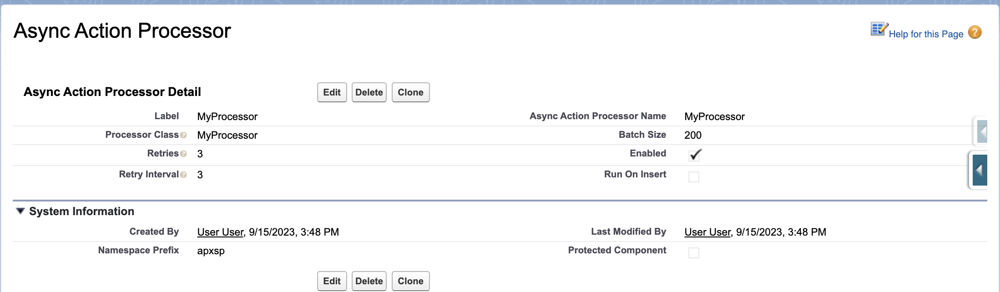

Welcome to `apex-async-actions`, a production-ready Salesforce platform tool designed to simplify and enhance asynchronous task management.

## Features

Apex Async Actions was designed to solve the challenges of asynchronous processing at scale, offering a comprehensive framework that's both powerful and easy to use.

You get the following out of the box:

-   **Asynchronous Task Management** - Create and manage custom asynchronous operations using Apex or Flow
-   **Built-in Error Handling** - Automatic retry logic with configurable retry behaviors and intervals
-   **Comprehensive Monitoring** - Track every operation instance as an `AsyncAction__c` record for full visibility
-   **Flexible Processor Types** - Support for both Apex classes and Flows as processor implementations
-   **Configurable Execution** - Control batch sizes, retry policies, and scheduling through metadata configuration
-   **Production Monitoring** - List views, related lists, and reporting capabilities for operational oversight
-   **Plugin Architecture** - Extensible logging framework with support for custom integrations
-   **Automatic Scheduling** - Built-in scheduled job management for regular processing intervals

Best of all, the framework is built 100% on the Salesforce platform using standard Salesforce technology. It's available as an unlocked package, and it always will be.

## Installation

`apex-async-actions` is available as an **unlocked** package with no namespace. You can find the latest version in the [Releases](https://github.com/jasonsiders/apex-async-actions/releases) tab.

Use the following command to install the package in your environment:

```sh
sf package install --package {{package_version_id}} --wait 10
```

Once installed, assign the `AsyncActionAdministrator` permission set to users who need access to view and edit `AsyncAction__c` records:

```sh
sf org assign permset -n AsyncActionAdministrator
```

## Quick Start

Once installed, creating asynchronous actions is a simple two-step process:

### 1. Create Your Processor

Choose between Apex or Flow to define your processor logic:

**Using Apex:**

```apex
public class FooProcessor implements AsyncActions.Processor {
	public void process(AsyncActionProcessor__mdt settings, List<AsyncAction__c> actions) {
		// Create a Bar__c record for each Foo__c related to the given actions
		List<Bar__c> bars = new List<Bar__c>();
		for (AsyncAction__c action : actions) {
			Id fooId = (Id) action?.RelatedRecordId__c;
			Bar__c bar = new Bar__c(Foo__c = fooId);
			bars?.add(bar);
			// Mark the action as completed
			action.Status__c = 'Completed';
		}
		insert bars;
	}
}
```

**Using Flow:**
Clone the included [Template Flow](./Template-Async-Action-Flow) and customize the logic. The framework automatically handles bulkification.

### 2. Configure Your Processor

Create an `AsyncActionProcessor__mdt` record to configure how your processor runs:



Set the _Processor_ field to your class name or flow API name, configure batch size and retry settings, then enable the processor.

### 3. Create Async Actions

Use the `AsyncActions.initAction()` method to create action records:

```apex
AsyncActionProcessor__mdt settings = AsyncActionProcessor__mdt.getInstance('My_Processor');
AsyncAction__c action = AsyncActions.initAction(settings, recordId, customData);
insert action;
```

The framework will automatically process pending actions based on your configuration!

## Core-Concepts

The framework operates on several key principles:

-   **Processors** define the logic to be executed asynchronously
-   **AsyncAction\_\_c records** represent individual work items to be processed
-   **AsyncActionProcessor\_\_mdt** configures how processors behave
-   **AsyncActionJob** is the queueable that orchestrates processing
-   **Status lifecycle** tracks actions from Pending → Completed/Failed

## Monitoring Your Actions

Track the status of your actions through the included UI components:


## Want To Learn More?

Check out the sidebar for comprehensive documentation about:

-   [Getting started guide](./Getting-Started) with detailed setup instructions
-   [Core concepts](./Core-Concepts) explaining the framework architecture
-   [Object documentation](./AsyncAction-Custom-Object) for all custom objects and fields
-   [Class documentation](./AsyncActions-Class) for all global classes and methods
-   [Flow integration](./Template-Async-Action-Flow) and customization guide
