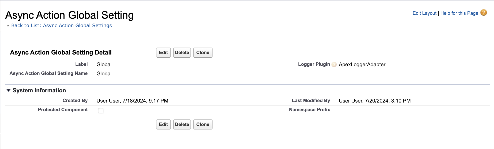

The `AsyncActionGlobalSetting__mdt` custom metadata type defines package-wide behavior for the async actions framework. It controls global settings that affect all processors and framework operations.

## Overview

AsyncActionGlobalSetting records provide a centralized location for framework-wide configuration. Unlike processor-specific settings, these configurations apply to all async action operations across your entire org.



## Purpose and Usage

Global settings control:

1. **Logging Framework** - Integration with external logging systems
2. **Framework Behavior** - System-wide operational parameters
3. **Plugin Configuration** - Extension points for custom functionality
4. **Debug Settings** - Development and troubleshooting options

The framework expects at most one AsyncActionGlobalSetting record. If multiple records exist, the framework will use the first record returned by the query. If no records exist, the framework uses default behavior.

## Field Reference

| Field API Name    | Label         | Data Type | Required | Default | Description                                          |
| ----------------- | ------------- | --------- | -------- | ------- | ---------------------------------------------------- |
| `DeveloperName`   | API Name      | Text(40)  | Yes      | -       | Unique identifier for the global settings            |
| `MasterLabel`     | Label         | Text(40)  | Yes      | -       | Human-readable name for the settings                 |
| `LoggerPlugin__c` | Logger Plugin | Text(255) | No       | -       | Fully qualified name of custom logger implementation |

## Field Details

### LoggerPlugin\_\_c

Specifies a custom logging implementation to replace the framework's default logging behavior.

**Default Behavior (when blank):**
The framework uses standard Salesforce debug logging:

```apex
System.debug(LoggingLevel.INFO, 'Processing 5 async actions');
System.debug(LoggingLevel.ERROR, 'Action failed: ' + errorMessage);
```

**Custom Logger Implementation:**
When specified, must be the fully qualified name of an Apex class that implements the `AsyncActionLogger.Adapter` interface:

```apex
public class CustomLoggerAdapter implements AsyncActionLogger.Adapter {
	public void log(System.LoggingLevel level, Object logMessage) {
		// Your custom logging implementation
		// Could integrate with external logging systems like:
		// - Nebula Logger
		// - Custom logging frameworks
		// - External monitoring systems
	}

	public void save() {
		// Commit/flush any pending log entries
		// Called at the end of each transaction
	}
}
```

**Configuration Example:**

```
LoggerPlugin__c = 'CustomLoggerAdapter'
LoggerPlugin__c = 'myns__ExternalLoggerAdapter'
```

## Plugin Framework

The global settings serve as the foundation for the framework's plugin architecture. Currently, only logging plugins are supported, but the architecture allows for future expansion.

### Logging Plugin Interface

All logging plugins must implement the `AsyncActionLogger.Adapter` interface:

```apex
public interface Adapter {
	/**
	 * Called by the framework to record log messages
	 * @param level The severity level of the message
	 * @param logMessage The message content (can be String, Exception, or other objects)
	 */
	void log(System.LoggingLevel level, Object logMessage);

	/**
	 * Called at the end of transactions to commit/flush log entries
	 * Use this method to perform any necessary cleanup or persistence
	 */
	void save();
}
```

### Example Implementations

**Nebula Logger Integration:**

```apex
public class NebulaLoggerAdapter implements AsyncActionLogger.Adapter {
	public void log(System.LoggingLevel level, Object logMessage) {
		Logger.getInstance().setLogLevel(level).log(String.valueOf(logMessage));
	}

	public void save() {
		Logger.getInstance().saveLog();
	}
}
```

**File-Based Logging:**

```apex
public class FileLoggerAdapter implements AsyncActionLogger.Adapter {
	private List<String> logEntries = new List<String>();

	public void log(System.LoggingLevel level, Object logMessage) {
		String timestamp = DateTime.now().format('yyyy-MM-dd HH:mm:ss');
		String entry = timestamp + ' [' + level.name() + '] ' + String.valueOf(logMessage);
		logEntries.add(entry);
	}

	public void save() {
		if (!logEntries.isEmpty()) {
			// Write to custom object, external system, etc.
			insertLogRecords(logEntries);
			logEntries.clear();
		}
	}

	private void insertLogRecords(List<String> entries) {
		// Implementation depends on your logging storage
	}
}
```

**External API Integration:**

```apex
public class ExternalLoggerAdapter implements AsyncActionLogger.Adapter {
	private List<LogEntry> pendingLogs = new List<LogEntry>();

	public void log(System.LoggingLevel level, Object logMessage) {
		pendingLogs.add(new LogEntry(level, String.valueOf(logMessage)));
	}

	public void save() {
		if (!pendingLogs.isEmpty() && !System.isFuture()) {
			sendLogsToExternalSystemFuture(JSON.serialize(pendingLogs));
			pendingLogs.clear();
		}
	}

	@future(callout=true)
	private static void sendLogsToExternalSystemFuture(String logsJson) {
		// Send to external logging service
	}

	private class LogEntry {
		public String level;
		public String message;
		public DateTime timestamp;

		public LogEntry(System.LoggingLevel level, String message) {
			this.level = level.name();
			this.message = message;
			this.timestamp = DateTime.now();
		}
	}
}
```

## Configuration Management

### Setup Process

1. **Create the Global Setting Record:**

    - Navigate to Setup → Custom Metadata Types → Async Action Global Setting → Manage Records
    - Create a new record with a descriptive label
    - Configure the LoggerPlugin\_\_c field if needed

2. **Deploy Logger Implementation:**

    - Create your custom logger class
    - Ensure it implements `AsyncActionLogger.Adapter`
    - Deploy to your target org

3. **Update Global Settings:**
    - Set LoggerPlugin\_\_c to your class name
    - Test logging functionality

### Testing Logger Plugins

```apex
@isTest
public class CustomLoggerAdapterTest {
	@isTest
	static void testCustomLogger() {
		// Setup global setting to use custom logger
		AsyncActionGlobalSetting__mdt setting = new AsyncActionGlobalSetting__mdt(
			DeveloperName = 'Test_Setting',
			MasterLabel = 'Test Setting',
			LoggerPlugin__c = 'CustomLoggerAdapter'
		);

		Test.startTest();

		// Trigger framework logging
		AsyncActionLogger.log(System.LoggingLevel.INFO, 'Test message');
		AsyncActionLogger.save();

		Test.stopTest();

		// Verify your logger was called
		// (Implementation depends on your logging mechanism)
	}
}
```

## Best Practices

### Logger Plugin Development

1. **Error Handling** - Logger failures should not break async action processing
2. **Performance** - Keep logging operations lightweight and fast
3. **Bulkification** - Batch log entries when possible
4. **Limits Awareness** - Consider governor limits when implementing save() method
5. **Testing** - Thoroughly test logger implementations

### Configuration Management

1. **Single Record** - Maintain only one global setting record
2. **Environment Consistency** - Use the same logger configuration across environments
3. **Fallback Behavior** - Framework continues working even if custom logger fails
4. **Documentation** - Document logger plugin configuration and behavior

### Operational Considerations

1. **Monitoring** - Monitor logger plugin performance and failures
2. **Maintenance** - Keep logger plugins updated with framework changes
3. **Capacity Planning** - Ensure external logging systems can handle volume
4. **Security** - Protect sensitive information in log messages

## Framework Integration

The global settings are automatically loaded and used by the framework:

```apex
// Framework code (simplified)
public class AsyncActionLogger {
	private static Adapter loggerInstance;

	static {
		AsyncActionGlobalSetting__mdt setting = AsyncActionGlobalSetting__mdt.getInstance();
		if (setting?.LoggerPlugin__c != null) {
			try {
				Type adapterType = Type.forName(setting.LoggerPlugin__c);
				loggerInstance = (Adapter) adapterType.newInstance();
			} catch (Exception e) {
				// Fall back to default logger
				loggerInstance = new DefaultLogger();
			}
		} else {
			loggerInstance = new DefaultLogger();
		}
	}

	public static void log(System.LoggingLevel level, Object message) {
		loggerInstance.log(level, message);
	}

	public static void save() {
		loggerInstance.save();
	}
}
```

## Troubleshooting

### Common Issues

**Logger Plugin Not Loading:**

-   Verify class name is spelled correctly in LoggerPlugin\_\_c
-   Ensure class implements AsyncActionLogger.Adapter interface
-   Check class is public/global and accessible
-   Review debug logs for instantiation errors

**Logging Performance Issues:**

-   Monitor execution time of log() and save() methods
-   Consider asynchronous logging for external systems
-   Implement proper bulkification in save() method
-   Cache external system connections where possible

**Framework Falling Back to Default Logger:**

-   Check for exceptions during logger plugin instantiation
-   Verify custom logger class is deployed to target org
-   Review global setting record configuration
-   Test logger plugin independently

### Debug Techniques

**Test Logger Loading:**

```apex
AsyncActionGlobalSetting__mdt setting = AsyncActionGlobalSetting__mdt.getInstance();
System.debug('Logger Plugin: ' + setting?.LoggerPlugin__c);

// Test direct instantiation
if (setting?.LoggerPlugin__c != null) {
    Type loggerType = Type.forName(setting.LoggerPlugin__c);
    AsyncActionLogger.Adapter logger = (AsyncActionLogger.Adapter) loggerType.newInstance();
    logger.log(System.LoggingLevel.INFO, 'Test message');
    logger.save();
}
```

## Related Components

-   [AsyncActionProcessor\_\_mdt](./AsyncActionProcessor-Custom-Metadata-Type) - Processor-specific configurations
