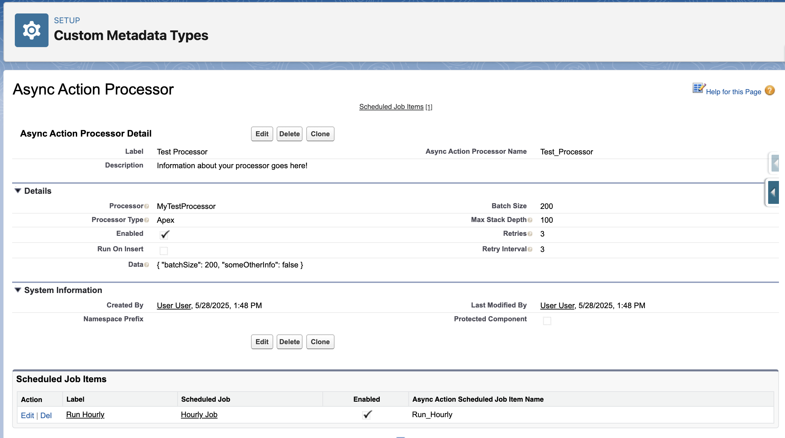

The `AsyncActionProcessor__mdt` custom metadata type governs the configuration of specific async action processor implementations. Each record defines how a processor behaves, including execution parameters, retry logic, and performance settings.

## Overview

AsyncActionProcessor metadata records serve as the configuration backbone for the async actions framework. They control every aspect of processor behavior, from basic settings like batch size to advanced features like automatic retry intervals.



## Purpose and Usage

AsyncActionProcessor records define:

1. **Processor Implementation** - Links to the Apex class or Flow that contains processing logic
2. **Execution Control** - Determines when and how the processor runs
3. **Performance Settings** - Controls batch sizes and processing limits
4. **Error Handling** - Configures retry behavior and failure management
5. **Operational Parameters** - Sets intervals, timeouts, and other operational aspects

## Field Reference

| Field API Name     | Label           | Data Type      | Required | Default | Description                                            |
| ------------------ | --------------- | -------------- | -------- | ------- | ------------------------------------------------------ |
| `DeveloperName`    | API Name        | Text(40)       | Yes      | -       | Unique identifier for the processor configuration      |
| `MasterLabel`      | Label           | Text(40)       | Yes      | -       | Human-readable name for the processor                  |
| `Processor__c`     | Processor       | Text(255)      | Yes      | -       | Fully qualified name of the Apex class or Flow         |
| `ProcessorType__c` | Processor Type  | Picklist       | Yes      | Apex    | Whether the processor is implemented in Apex or Flow   |
| `Enabled__c`       | Enabled         | Checkbox       | No       | true    | Controls whether this processor can execute            |
| `BatchSize__c`     | Batch Size      | Number(18,0)   | Yes      | 200     | Number of AsyncAction records to process per execution |
| `Retries__c`       | Retries         | Number(18,0)   | No       | 0       | Default number of retry attempts for new actions       |
| `RetryInterval__c` | Retry Interval  | Number(18,0)   | No       | 5       | Minutes to wait between retry attempts                 |
| `RunOnInsert__c`   | Run On Insert   | Checkbox       | No       | false   | Whether to automatically process actions when inserted |
| `MaxStackDepth__c` | Max Stack Depth | Number(18,0)   | No       | 1       | Maximum recursion depth for chained processing         |
| `Data__c`          | Data            | Long Text Area | No       | -       | Custom configuration data for the processor            |
| `Description__c`   | Description     | Long Text Area | No       | -       | Documentation about the processor's purpose            |

## Field Details

### DeveloperName (API Name)

-   Must be unique across all AsyncActionProcessor records
-   Used by AsyncAction records in the `ProcessorName__c` field
-   Case-sensitive when referenced in code
-   Cannot be changed after creation

**Naming Conventions:**

```
Account_Followup_Processor
Lead_Conversion_Processor
Email_Notification_Processor
```

### Processor\_\_c

The fully qualified name of your processor implementation:

**For Apex Classes:**

```
MyProcessor                    // Class in same namespace
myns__MyProcessor             // Class in managed package
MyProcessor.InnerClass        // Inner class (not recommended)
```

**For Flows:**

```
My_Processor_Flow             // Flow API name
myns__My_Processor_Flow       // Flow in managed package
```

**Requirements:**

-   Apex classes must implement `AsyncActions.Processor` interface
-   Apex classes must have a public no-argument constructor
-   Flows must have the required input/output variables
-   Must be unique across all processor configurations

### ProcessorType\_\_c

Determines how the framework instantiates your processor:

-   **Apex** - Uses `Type.forName()` to create an instance of the specified class
-   **Flow** - Uses `AsyncActionFlowProcessor` as a wrapper to execute the specified Flow

### Enabled\_\_c

Master switch for processor execution:

-   **Checked** - Processor can execute normally
-   **Unchecked** - All processing attempts are skipped
-   Can be toggled to temporarily disable problematic processors
-   Does not affect existing AsyncAction records

### BatchSize\_\_c

Controls the number of AsyncAction records processed in a single execution:

**Considerations:**

-   **Larger batches** = Better efficiency, higher risk of governor limits
-   **Smaller batches** = More reliable, higher overhead
-   **Recommended range** = 10-200 depending on processor complexity
-   **Maximum effective** = 200 (Salesforce queueable limits)

**Governor Limit Impact:**

```apex
// Bad: Could hit SOQL limits with large batches
for (AsyncAction__c action : actions) {  // 200 actions
    Account acc = [SELECT Name FROM Account WHERE Id = :action.RelatedRecordId__c];
}

// Good: Bulk query pattern
Set<Id> accountIds = /* extract from actions */;
Map<Id, Account> accounts = new Map<Id, Account>([SELECT Name FROM Account WHERE Id IN :accountIds]);
```

### Retries\_\_c

Default number of retry attempts for new AsyncAction records:

-   Applied when creating actions via `AsyncActions.initAction()`
-   Can be overridden per-action if needed
-   Set to 0 to disable retries for this processor
-   Maximum practical value depends on retry interval and business requirements

### RetryInterval\_\_c

Minutes to wait between retry attempts:

-   Used when actions fail and have retries remaining
-   Prevents immediate retry loops that could mask underlying issues
-   Should be long enough for transient issues to resolve
-   Typical values: 5-60 minutes depending on use case

**Retry Calculation:**

```apex
DateTime nextRetry = DateTime.now().addMinutes(settings.RetryInterval__c);
action.NextEligibleAt__c = nextRetry;
```

### RunOnInsert\_\_c

Controls automatic processing when AsyncAction records are created:

**Checked (true):**

-   AsyncActionTrigger automatically queues processing
-   Near real-time processing for time-sensitive operations
-   Higher system resource usage

**Unchecked (false):**

-   Processing only occurs via scheduled jobs or manual triggers
-   Better for batch-oriented operations
-   More predictable system load

### MaxStackDepth\_\_c

Limits recursive processing to prevent infinite loops:

-   Prevents processors from creating actions that trigger themselves
-   Default value of 1 allows one level of chained processing
-   Increase carefully for legitimate multi-level workflows
-   Set to 0 to completely prevent chained processing

### Data\_\_c

Custom configuration data specific to your processor:

-   Typically stores JSON configuration objects
-   Accessible in processor implementations via the settings parameter
-   Not validated by the framework
-   Useful for processor-specific parameters

**Example Usage:**

```apex
// In metadata record
{
  "notificationEmail": "admin@company.com",
  "maxRetries": 5,
  "enableLogging": true
}

// In processor implementation
Map<String, Object> config = (Map<String, Object>) JSON.deserializeUntyped(settings.Data__c);
String notificationEmail = (String) config.get('notificationEmail');
```

## Configuration Patterns

### High-Volume Batch Processing

```
Processor: BulkDataProcessor
ProcessorType: Apex
Enabled: ✓
BatchSize: 200
Retries: 1
RetryInterval: 30
RunOnInsert: ✗
MaxStackDepth: 1
```

### Real-Time Processing

```
Processor: NotificationProcessor
ProcessorType: Flow
Enabled: ✓
BatchSize: 10
Retries: 3
RetryInterval: 5
RunOnInsert: ✓
MaxStackDepth: 1
```

### Reliable Data Integration

```
Processor: ExternalSystemSync
ProcessorType: Apex
Enabled: ✓
BatchSize: 50
Retries: 5
RetryInterval: 15
RunOnInsert: ✗
MaxStackDepth: 0
```

## Best Practices

### Performance Optimization

1. **Start Small** - Begin with smaller batch sizes and increase as needed
2. **Monitor Limits** - Watch for governor limit exceptions in debug logs
3. **Profile Performance** - Measure actual processing times and adjust accordingly
4. **Consider Complexity** - Reduce batch size for processor-intensive operations

### Reliability Configuration

1. **Appropriate Retries** - Set retry counts based on expected failure patterns
2. **Reasonable Intervals** - Allow enough time for transient issues to resolve
3. **Enable Monitoring** - Use description fields to document expected behavior
4. **Test Thoroughly** - Validate configuration under realistic load conditions

### Operational Management

1. **Descriptive Names** - Use clear, consistent naming conventions
2. **Document Purpose** - Fill in description fields with operational details
3. **Version Control** - Track configuration changes in source control
4. **Environment Sync** - Keep configurations consistent across environments

## Deployment and Migration

### Source Control

AsyncActionProcessor metadata can be included in source control:

```xml
<?xml version="1.0" encoding="UTF-8" ?>
<CustomMetadata xmlns="http://soap.sforce.com/2006/04/metadata">
    <label>Account Followup Processor</label>
    <protected>false</protected>
    <values>
        <field>BatchSize__c</field>
        <value>50</value>
    </values>
    <values>
        <field>Enabled__c</field>
        <value>true</value>
    </values>
    <!-- Additional field values -->
</CustomMetadata>
```

### Environment-Specific Configuration

Use custom metadata deployment for environment-specific settings:

-   **Sandbox** - Smaller batch sizes, more retries for testing
-   **Production** - Optimized batch sizes, conservative retry settings
-   **Integration** - External system specific intervals and timeouts

## Monitoring and Troubleshooting

### Common Issues

**Processor Not Running:**

-   Verify `Enabled__c` is checked
-   Check `Processor__c` class/flow name is correct
-   Ensure processor class implements required interface
-   Verify processor class is accessible (public/global)

**Performance Problems:**

-   Reduce `BatchSize__c` if hitting governor limits
-   Increase `RetryInterval__c` if external systems are overloaded
-   Monitor execution times in debug logs
-   Check for inefficient SOQL/DML patterns in processor code

**Excessive Retries:**

-   Review `Retries__c` setting for appropriate business logic
-   Investigate root causes of failures rather than increasing retries
-   Consider implementing exponential backoff in processor logic
-   Monitor error patterns in AsyncAction error fields

### Monitoring Queries

**Find all enabled processors:**

```sql
SELECT DeveloperName, Processor__c, ProcessorType__c, BatchSize__c
FROM AsyncActionProcessor__mdt
WHERE Enabled__c = true
```

**Check processor performance settings:**

```sql
SELECT DeveloperName, BatchSize__c, Retries__c, RetryInterval__c, RunOnInsert__c
FROM AsyncActionProcessor__mdt
ORDER BY DeveloperName
```

## Related Objects

-   [AsyncAction\_\_c](./AsyncAction-Custom-Object) - Records that reference these configurations
-   [AsyncActionScheduledJobItem\_\_mdt](./AsyncActionScheduledJobItem-Custom-Metadata-Type) - Scheduled execution of processors
-   [AsyncActionGlobalSetting\_\_mdt](./AsyncActionGlobalSetting-Custom-Metadata-Type) - Framework-wide settings

## See Also

-   [Creating-Your-First-Processor](./Creating-Your-First-Processor) - Step-by-step processor creation guide
