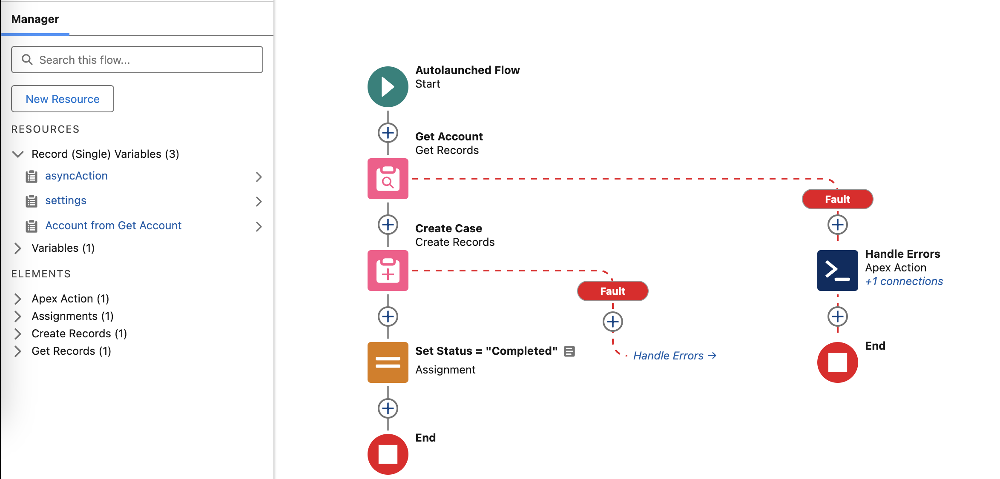

# Template: Async Action Flow

The Template Async Action Flow is a pre-built Flow template that demonstrates the proper structure for creating Flow-based async action processors. It serves as a starting point for declarative async action implementations.

## Overview

This template flow provides the correct input/output variable structure and basic processing logic required for Flow processors. You can clone and customize it to create your own Flow-based async action processors without writing Apex code.



## Flow Details

**API Name:** `Template_Async_Action_Flow`
**Type:** Auto-Launched Flow
**Status:** Active (Template)
**API Version:** 63.0

## Input/Output Variables

The template includes the required variables that the framework expects:

### Input Variables

| Variable Name | Data Type                   | Required | Description                             |
| ------------- | --------------------------- | -------- | --------------------------------------- |
| `asyncAction` | AsyncAction\_\_c            | Yes      | The async action record being processed |
| `settings`    | AsyncActionProcessor\_\_mdt | Yes      | Processor configuration settings        |

### Output Variables

| Variable Name | Data Type        | Required | Description                                         |
| ------------- | ---------------- | -------- | --------------------------------------------------- |
| `asyncAction` | AsyncAction\_\_c | Yes      | Updated async action record with processing results |

## Flow Logic

The template implements basic success logic:

1. **Assignment Element** - Sets the asyncAction.Status\_\_c to \"Completed\"
2. **Output Assignment** - Returns the updated asyncAction record

This minimal implementation demonstrates the expected pattern:

-   Receive the action and settings as input
-   Perform your business logic
-   Update the action status appropriately
-   Return the updated action

## Cloning the Template

### Step 1: Access Flow Builder

1. Navigate to **Setup → Flows**
2. Find \"Template: Async Action Flow\"
3. Click the dropdown arrow next to the flow name
4. Select **Clone**

### Step 2: Configure Your Clone

1. **Flow Label:** Give your flow a descriptive name (e.g., \"Account Follow-up Flow\")
2. **Flow API Name:** Use a clear API name (e.g., \"Account_Followup_Flow\")
3. **Description:** Document the flow's purpose and business logic

### Step 3: Customize Business Logic

Replace the basic \"Set Status = Completed\" logic with your actual business requirements:

#### Example: Create Follow-up Task

```
1. Get Records - Query Account using asyncAction.RelatedRecordId__c
2. Assignment - Build Task record with account details
3. Create Records - Insert the Task
4. Decision - Check if Task creation succeeded
   → Success: Set asyncAction.Status__c = \"Completed\"
   → Failure: Use \"Handle Async Action Failures\" invocable
```

#### Example: Send Notification Email

```
1. Get Records - Query Contact using asyncAction.RelatedRecordId__c
2. Assignment - Parse custom data from asyncAction.Data__c
3. Action - Send Email using standard email actions
4. Decision - Check email result
   → Success: Set asyncAction.Status__c = \"Completed\"
   → Failure: Use \"Handle Async Action Failures\" invocable
```

### Step 4: Error Handling

For error scenarios, use the \"Handle Async Action Failures\" invocable action:

**Inputs:**

-   **action:** `{!asyncAction}`
-   **developerName:** Your processor's DeveloperName (e.g., \"My_Flow_Processor\")
-   **errorMessage:** Error description (e.g., `{!$Flow.FaultMessage}`)
-   **retryBehaviorName:** \"ALLOW_RETRY\", \"KEEP_ALIVE\", or \"SUDDEN_DEATH\"

## Processor Configuration

After creating your flow, configure the processor metadata:

### AsyncActionProcessor\_\_mdt Record

Create a processor configuration record:

-   **Label:** Descriptive name for your processor
-   **Processor:** Your flow's API name (e.g., \"Account_Followup_Flow\")
-   **Processor Type:** Flow
-   **Enabled:** ✓ (checked)
-   **Batch Size:** 10-50 (Flows process one action at a time, but framework batches the calls)
-   **Other settings:** Configure retries, intervals, etc. as needed

## Flow Bulkification

**Important:** Even though your flow processes one AsyncAction\_\_c at a time, the framework automatically bulkifies flow execution using Salesforce's `Invocable.Action` pattern.

This means:

-   Your flow receives one action per execution
-   Framework may run your flow multiple times in parallel
-   Flow governor limits apply to the cumulative execution
-   Design your flow to be efficient for repeated execution

## Advanced Patterns

### Using Custom Data

Parse JSON data from the `asyncAction.Data__c` field:

```
1. Assignment - Extract JSON string from asyncAction.Data__c
2. Action - Use \"Deserialize JSON\" or custom parsing logic
3. Assignment - Extract specific values for your business logic
4. [Your business logic using the parsed data]
```

### Conditional Processing

Use decision elements to handle different scenarios:

```
1. Decision - Check asyncAction.Data__c content
   → Priority = \"High\": Execute urgent processing path
   → Priority = \"Normal\": Execute standard processing path
   → Default: Set status to completed with no action
```

### Related Record Processing

Work with related records through RelatedRecordId\_\_c:

```
1. Assignment - Store asyncAction.RelatedRecordId__c in variable
2. Get Records - Query the related record using the ID
3. Decision - Verify record was found
   → Found: Continue with business logic
   → Not Found: Use failure invocable with appropriate error
```

## Testing Your Flow

### Flow Testing

1. Use Flow Builder's **Debug** feature
2. Provide test values for input variables:
    - Create a test AsyncAction\_\_c record
    - Create or query an AsyncActionProcessor\_\_mdt record
3. Run the flow and verify the logic works correctly

### Integration Testing

```apex
@isTest
public class MyFlowProcessorTest {
	@isTest
	static void testFlowProcessor() {
		// Create test processor configuration
		AsyncActionProcessor__mdt settings = new AsyncActionProcessor__mdt(
			DeveloperName = 'My_Flow_Processor',
			Processor__c = 'My_Flow_Name',
			ProcessorType__c = 'Flow',
			Enabled__c = true
		);

		// Create test action
		AsyncAction__c action = AsyncActions.initAction(settings, testRecordId);
		insert action;

		Test.startTest();
		// Action should be processed automatically if RunOnInsert is enabled
		Test.stopTest();

		// Verify results
		action = [SELECT Status__c FROM AsyncAction__c WHERE Id = :action.Id];
		System.assertEquals('Completed', action.Status__c);
	}
}
```

## Best Practices

### Flow Design

1. **Keep It Simple** - Flows should handle straightforward business logic
2. **Error Handling** - Always include error handling paths
3. **Efficient Queries** - Minimize SOQL operations in your flow
4. **Bulkification Awareness** - Remember your flow may run many times in quick succession

### Performance Considerations

1. **Governor Limits** - Flow limits apply cumulatively across all executions
2. **DML Operations** - Keep DML operations efficient
3. **External Callouts** - Consider timeout and retry scenarios
4. **Resource Usage** - Monitor flow execution statistics

### Maintainability

1. **Documentation** - Use flow descriptions and element labels effectively
2. **Version Control** - Include flows in your deployment packages
3. **Testing** - Create comprehensive test coverage
4. **Monitoring** - Set up alerts for flow failures

## Common Patterns

### Email Notification Flow

```
Input: asyncAction with Contact ID
Logic:
1. Get Contact record
2. Parse email template data from asyncAction.Data__c
3. Send email using Email Alert or Send Email action
4. Update status based on success/failure
```

### Record Update Flow

```
Input: asyncAction with record ID and update data
Logic:
1. Get target record using RelatedRecordId__c
2. Parse update data from Data__c field
3. Update record fields
4. Handle success/failure appropriately
```

### Integration Flow

```
Input: asyncAction with integration parameters
Logic:
1. Parse integration data from Data__c
2. Make external callout (if using Platform Events or future methods)
3. Process response
4. Update action status
```

## Troubleshooting

### Common Issues

**Flow Not Executing:**

-   Verify processor configuration has correct flow API name
-   Check that processor is enabled
-   Ensure flow is active and not in draft status
-   Verify input variables match expected names and types

**Flow Failing:**

-   Check flow fault emails for error details
-   Review debug logs for flow execution details
-   Verify all required input variables are provided
-   Test flow manually with sample data

**Performance Problems:**

-   Monitor flow execution statistics in Setup → Process Automation Settings
-   Check for inefficient SOQL patterns
-   Review DML operation frequency
-   Consider breaking complex flows into smaller pieces

### Debug Techniques

**Flow Debug Mode:**

1. Open flow in Flow Builder
2. Click **Debug**
3. Provide test input values
4. Step through execution to identify issues

**System Debug:**

```apex
// Test flow execution programmatically
Flow.Interview flowInstance = new Flow.Interview.My_Flow_Name(
    new Map<String, Object>{
        'asyncAction' => testAction,
        'settings' => testSettings
    }
);
flowInstance.start();

// Check outputs
AsyncAction__c updatedAction = (AsyncAction__c) flowInstance.getVariableValue('asyncAction');
System.debug('Updated Status: ' + updatedAction.Status__c);
```

## Related Components

-   [AsyncActionFlowProcessor](./The-AsyncActionFlowProcessor-Class) - Apex wrapper that executes flows
-   [AsyncActionProcessor\_\_mdt](./Object-AsyncActionProcessor) - Configuration for flow processors
-   [InvocableFailAsyncAction](./The-InvocableFailAsyncAction-Class) - Flow-compatible error handling

## See Also

-   [Creating Your First Processor](./Creating-Your-First-Processor) - Apex processor tutorial
-   [Core Concepts](./Core-Concepts) - Framework architecture overview
-   [Flow Documentation](https://help.salesforce.com/s/articleView?id=sf.flow.htm) - Salesforce Flow fundamentals
