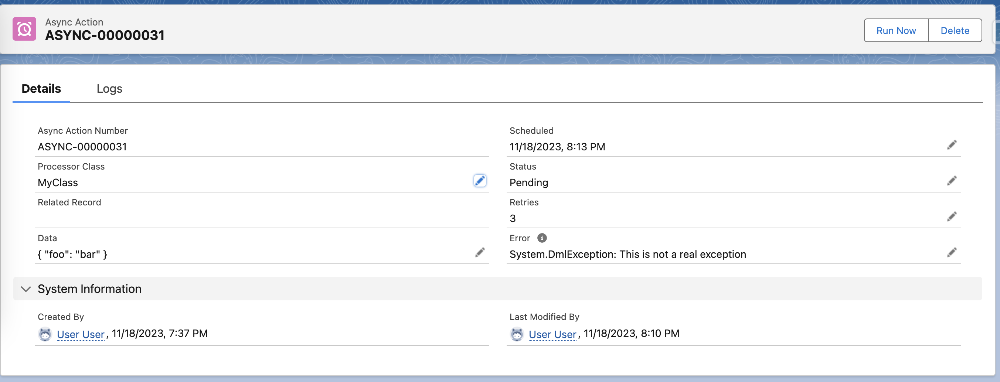
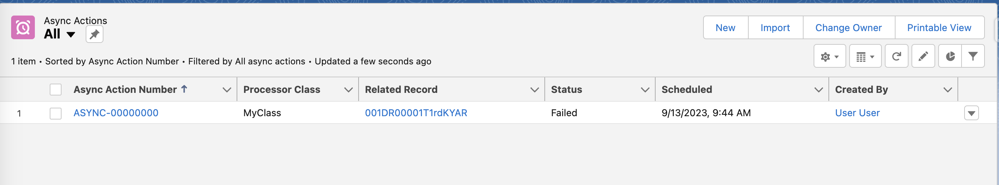
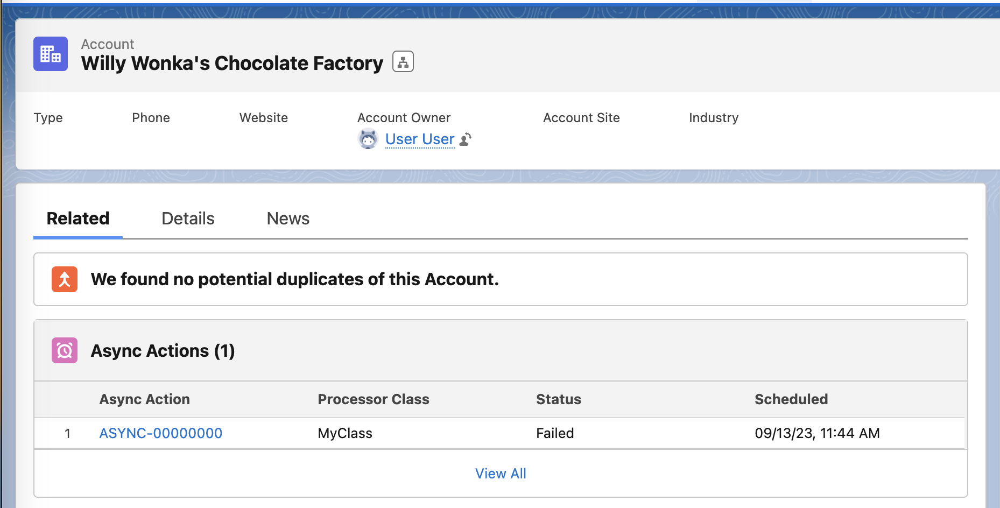

# The `AsyncAction__c` Custom Object

The `AsyncAction__c` object is the cornerstone of the async actions framework. Each record represents an individual work item to be processed asynchronously by the framework.

## Overview

AsyncAction records serve as both the request and the audit trail for asynchronous operations. They track the status of requests throughout their lifecycle and provide context information to processor implementations.



## Purpose and Usage

The primary functions of AsyncAction records are:

1. **Work Queue Management** - Represent individual tasks waiting to be processed
2. **Context Storage** - Carry data and relationships needed by processors
3. **Status Tracking** - Monitor the progress of asynchronous operations
4. **Error Management** - Store error details and support retry logic
5. **Audit Trail** - Maintain a historical record of all async operations

## Lifecycle

Every AsyncAction follows a predictable lifecycle:

1. **Creation** - Record is created with "Pending" status
2. **Processing** - Framework queries eligible records and processes them
3. **Completion** - Record ends in one of four final states:
    - **Completed** - Successfully processed
    - **Failed** - Permanently failed (no retries remaining)
    - **Canceled** - Manually canceled
    - **Pending** - Still awaiting processing or retry

## Creating AsyncAction Records

While you can create AsyncAction records manually, the recommended approach is using the framework's utility methods:

### Using AsyncActions.initAction()

```apex
// Basic usage
AsyncActionProcessor__mdt settings = AsyncActionProcessor__mdt.getInstance('My_Processor');
AsyncAction__c action = AsyncActions.initAction(settings, recordId, jsonData);
insert action;

// Available overloads
AsyncActions.initAction(settings, recordId, data)      // Full parameters
AsyncActions.initAction(settings, record, data)       // SObject instead of Id
AsyncActions.initAction(settings, recordId)           // No custom data
AsyncActions.initAction(settings, record)             // SObject, no data
AsyncActions.initAction(settings)                     // No related record or data
```

### Using Invocable Actions

The framework includes Flow-compatible invocable actions:

-   **Init Async Action** - Creates new AsyncAction records
-   **Handle Async Action Failures** - Manages error scenarios

## Field Reference

| Field API Name       | Label               | Data Type      | Required | Description                                                                    |
| -------------------- | ------------------- | -------------- | -------- | ------------------------------------------------------------------------------ |
| `Name`               | Async Action Number | Auto Number    | Yes      | System-generated unique identifier (ASYNC-{00000000})                          |
| `ProcessorName__c`   | Processor Name      | Text(255)      | Yes      | DeveloperName of the AsyncActionProcessor\_\_mdt that will process this record |
| `Status__c`          | Status              | Picklist       | Yes      | Current processing status (Pending, Completed, Failed, Canceled)               |
| `RelatedRecordId__c` | Related Record Id   | Text(18)       | No       | Id of any Salesforce record related to this action                             |
| `RelatedRecord__c`   | Related Record      | Formula        | No       | Read-only hyperlink to the related record for UI display                       |
| `Data__c`            | Data                | Long Text Area | No       | Custom data structure (usually JSON) for processor context                     |
| `Error__c`           | Error               | Long Text Area | No       | Details about the most recent error, if any                                    |
| `Retries__c`         | Retries             | Number(18,0)   | No       | Number of retry attempts remaining before permanent failure                    |
| `NextEligibleAt__c`  | Next Eligible At    | DateTime       | Yes      | When this action becomes eligible for processing                               |

## Field Details

### ProcessorName\_\_c

-   Must match the `DeveloperName` of an active `AsyncActionProcessor__mdt` record
-   Case-sensitive string comparison
-   Framework queries for actions with matching processor names

**Example:**

```apex
action.ProcessorName__c = 'Account_Followup_Processor';
```

### Status\_\_c

The status field uses a controlled picklist with these values:

-   **Pending** (default) - Action is awaiting processing
-   **Completed** - Action was successfully processed
-   **Failed** - Action failed permanently (no retries remaining)
-   **Canceled** - Action was manually canceled

**Status Transitions:**

```
Pending → Completed  (success)
Pending → Failed     (error with no retries)
Pending → Pending    (error with retries - deferred)
Any → Canceled       (manual cancellation)
```

### RelatedRecordId\_\_c

-   Stores the 15 or 18-character Salesforce record Id
-   Can reference any standard or custom object
-   Used by processors to fetch related data or perform operations
-   Not validated by the platform (processors should handle invalid Ids)

**Example Usage:**

```apex
// In processor implementation
Id accountId = (Id) action.RelatedRecordId__c;
Account relatedAccount = [SELECT Name FROM Account WHERE Id = :accountId];
```

### Data\_\_c

-   Long text area supporting up to 131,072 characters
-   Typically stores JSON-serialized data structures
-   Provides flexible context information to processors
-   Not validated by the platform (processors should handle malformed data)

**Example Usage:**

```apex
// Creating action with custom data
Map<String, Object> customData = new Map<String, Object>{
    'priority' => 'High',
    'amount' => 1000,
    'dueDate' => Date.today().addDays(30)
};
action.Data__c = JSON.serialize(customData);

// In processor implementation
Map<String, Object> data = (Map<String, Object>) JSON.deserializeUntyped(action.Data__c);
String priority = (String) data.get('priority');
```

### Error\_\_c

-   Automatically populated by the framework when errors occur
-   Truncated to 1,000 characters if error message is longer
-   Cleared when action is retried successfully
-   Used for troubleshooting and monitoring

### Retries\_\_c

-   Defaults to the value configured in `AsyncActionProcessor__mdt.Retries__c`
-   Decremented by 1 each time an action fails and is retried
-   When reaches 0, subsequent failures cause permanent failure
-   Can be manually modified to allow additional retries

### NextEligibleAt\_\_c

-   Controls when the action can be processed
-   Defaults to `NOW()` for immediate processing
-   Updated by retry logic to defer failed actions
-   Framework only processes actions where this value is in the past

**Retry Interval Calculation:**

```apex
// When an action fails and has retries remaining
Integer intervalMinutes = settings.RetryInterval__c ?? 5;
action.NextEligibleAt__c = DateTime.now().addMinutes(intervalMinutes);
```

## Querying AsyncAction Records

### Common Query Patterns

**Find pending actions for a processor:**

```sql
SELECT Id, ProcessorName__c, RelatedRecordId__c, Data__c
FROM AsyncAction__c
WHERE ProcessorName__c = 'My_Processor'
  AND Status__c = 'Pending'
  AND NextEligibleAt__c <= NOW()
ORDER BY NextEligibleAt__c ASC
```

**Monitor recent action status:**

```sql
SELECT Id, Status__c, Error__c, ProcessorName__c, CreatedDate
FROM AsyncAction__c
WHERE CreatedDate = TODAY
ORDER BY CreatedDate DESC
```

**Find failed actions for investigation:**

```sql
SELECT Id, ProcessorName__c, Error__c, Retries__c, RelatedRecordId__c
FROM AsyncAction__c
WHERE Status__c = 'Failed'
  AND CreatedDate >= LAST_N_DAYS:7
```

## Monitoring and Reporting

### List Views

The framework includes several pre-built list views:

-   **All Actions** - Complete view of all AsyncAction records
-   **Recent Actions** - Actions created in the last 7 days
-   **Failed Actions** - Actions that have permanently failed
-   **Pending Actions** - Actions awaiting processing



### Related List Component

Use the included Lightning component to display related actions on record pages:



### Reports and Dashboards

Create custom reports to monitor:

-   Processing success rates by processor
-   Average processing times
-   Error patterns and trends
-   Retry frequency and success rates

## Best Practices

### Data Design

1. **Keep Data Small** - Store only essential information in `Data__c`
2. **Use JSON Consistently** - Standardize on JSON serialization for complex data
3. **Validate Input** - Check for required fields and data formats in processors
4. **Handle Missing Data** - Design processors to work with minimal context

### Performance Optimization

1. **Batch Operations** - Process multiple actions together when possible
2. **Selective Queries** - Only query fields needed by your processor
3. **Index Considerations** - Consider custom indexes for frequently queried fields
4. **Data Archival** - Implement cleanup processes for old completed actions

### Error Handling

1. **Meaningful Errors** - Provide specific error messages for troubleshooting
2. **Retry Strategy** - Configure appropriate retry counts and intervals
3. **Monitoring** - Set up alerts for high failure rates
4. **Manual Intervention** - Provide processes for manual retry/cancellation

## Integration Patterns

### Trigger-Based Creation

```apex
trigger AccountTrigger on Account (after insert, after update) {
    if (Trigger.isAfter) {
        List<AsyncAction__c> actions = new List<AsyncAction__c>();
        AsyncActionProcessor__mdt settings = AsyncActionProcessor__mdt.getInstance('Account_Processor');

        for (Account acc : Trigger.new) {
            if (/* some condition */) {
                actions.add(AsyncActions.initAction(settings, acc.Id));
            }
        }

        if (!actions.isEmpty()) {
            insert actions;
        }
    }
}
```

### Batch Processing

```apex
public class AccountBatchProcessor implements Database.Batchable<SObject> {
	public Database.QueryLocator start(Database.BatchableContext bc) {
		return Database.getQueryLocator('SELECT Id FROM Account WHERE LastModifiedDate = TODAY');
	}

	public void execute(Database.BatchableContext bc, List<Account> accounts) {
		List<AsyncAction__c> actions = new List<AsyncAction__c>();
		AsyncActionProcessor__mdt settings = AsyncActionProcessor__mdt.getInstance('Account_Processor');

		for (Account acc : accounts) {
			actions.add(AsyncActions.initAction(settings, acc.Id));
		}

		insert actions;
	}

	public void finish(Database.BatchableContext bc) {
		// Optional cleanup
	}
}
```

## Related Objects

-   [AsyncActionProcessor\_\_mdt](./Object-AsyncActionProcessor) - Configuration for processors
-   [AsyncActionStart\_\_e](./Object-AsyncActionStart) - Platform event for triggering processing
-   [AsyncActionGlobalSetting\_\_mdt](./Object-AsyncActionGlobalSetting) - Global framework settings

## See Also

-   [AsyncActions Class](./The-AsyncActions-Class) - Primary framework class for creating actions
-   [AsyncActionJob Class](./The-AsyncActionJob-Class) - The queueable that processes actions
-   [Error Handling Guide](./Error-Handling-and-Retry-Logic) - Comprehensive error handling patterns
