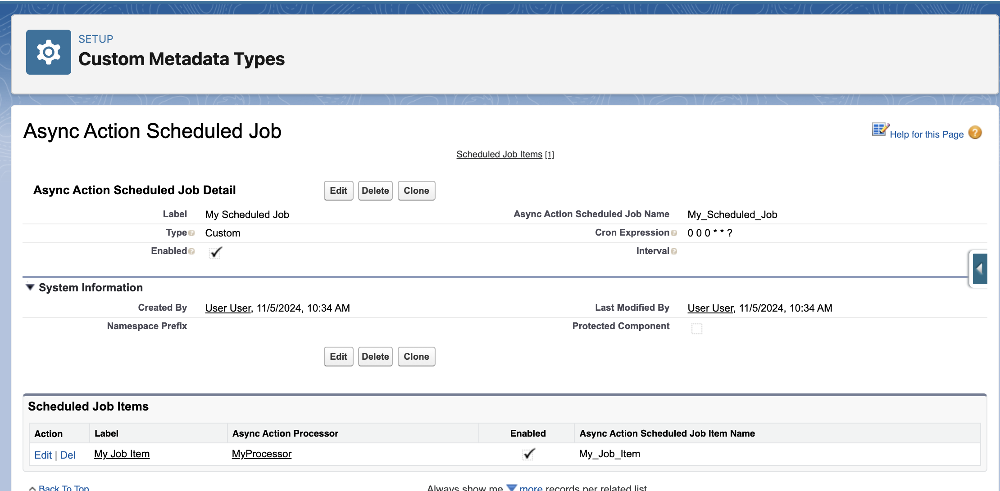

# The `AsyncActionScheduledJob__mdt` Custom Metadata Type

The `AsyncActionScheduledJob__mdt` custom metadata type defines automatic scheduled jobs that process accumulated async actions at regular intervals. These records enable hands-off operation of async action processors.

## Overview

AsyncActionScheduledJob records automatically create and manage Salesforce scheduled jobs that run the `AsyncActionSchedulable` class. This provides a declarative way to set up recurring processing without manual job management.



## Purpose and Usage

Scheduled job records provide:

1. **Automatic Job Creation** - Framework creates scheduled jobs based on metadata configuration
2. **Recurring Processing** - Process accumulated actions at predictable intervals
3. **Flexible Scheduling** - Support for hourly, semi-hourly, and custom cron schedules
4. **Operational Control** - Enable/disable scheduled processing without code changes
5. **Multi-Processor Support** - Link multiple processors to a single schedule

## Field Reference

| Field API Name      | Label           | Data Type    | Required | Default          | Description                                      |
| ------------------- | --------------- | ------------ | -------- | ---------------- | ------------------------------------------------ |
| `DeveloperName`     | API Name        | Text(40)     | Yes      | -                | Unique identifier for the scheduled job          |
| `MasterLabel`       | Label           | Text(40)     | Yes      | -                | Human-readable name for the scheduled job        |
| `Enabled__c`        | Enabled         | Checkbox     | No       | true             | Controls whether the scheduled job is active     |
| `Type__c`           | Type            | Picklist     | Yes      | Custom           | Scheduling pattern (Custom, Hourly, Semi-Hourly) |
| `CronExpression__c` | Cron Expression | Text(20)     | No       | "0 0 \* \* \* ?" | Custom cron expression for flexible scheduling   |
| `Interval__c`       | Interval        | Number(18,0) | No       | 30               | Minutes between executions for Semi-Hourly type  |

## Field Details

### Type\_\_c

Determines the scheduling pattern for the job:

**Custom**

-   Uses the `CronExpression__c` field for scheduling
-   Provides maximum flexibility for complex schedules
-   Requires understanding of cron syntax

**Hourly**

-   Runs at the top of every hour (e.g., 1:00, 2:00, 3:00)
-   Simple and predictable scheduling
-   Good for regular batch processing

**Semi-Hourly**

-   Runs every N minutes as specified in `Interval__c`
-   Useful for more frequent processing
-   Default interval is 30 minutes

### CronExpression\_\_c

Standard Salesforce cron expression for custom scheduling:

**Format:** `seconds minutes hours day_of_month month day_of_week optional_year`

**Common Examples:**

```
0 0 * * * ?     # Every hour at the top of the hour
0 */15 * * * ?  # Every 15 minutes
0 0 8 * * ?     # Every day at 8:00 AM
0 0 9 ? * MON   # Every Monday at 9:00 AM
0 30 14 ? * *   # Every day at 2:30 PM
```

### Interval\_\_c

For Semi-Hourly type, specifies the number of minutes between executions:

-   **Minimum:** 1 minute (not recommended for production)
-   **Maximum:** 59 minutes
-   **Recommended:** 15-30 minutes for balance of responsiveness and system load
-   **Consideration:** Salesforce has limits on scheduled job frequency

### Enabled\_\_c

Master switch for the scheduled job:

-   **Checked:** Framework will create/maintain the scheduled job
-   **Unchecked:** Framework will abort/remove the scheduled job
-   **Dynamic:** Can be toggled to start/stop scheduled processing

## Scheduling Patterns

### Business Hours Processing

```
Type: Custom
CronExpression: 0 0 9-17 ? * MON-FRI
Description: Every hour during business hours, weekdays only
```

### High-Frequency Processing

```
Type: Semi-Hourly
Interval: 15
Description: Every 15 minutes around the clock
```

### Daily Batch Processing

```
Type: Custom
CronExpression: 0 0 2 * * ?
Description: Every day at 2:00 AM for low-impact processing
```

### Weekly Maintenance

```
Type: Custom
CronExpression: 0 0 1 ? * SUN
Description: Every Sunday at 1:00 AM for weekly cleanup
```

## Framework Integration

The framework automatically manages scheduled jobs based on these metadata records:

### Job Creation Process

1. **Startup Check** - Framework scans for enabled AsyncActionScheduledJob records
2. **Job Verification** - Checks if corresponding Salesforce scheduled job exists
3. **Job Creation** - Creates missing jobs using the specified schedule
4. **Job Updates** - Updates existing jobs if configuration changes
5. **Job Cleanup** - Removes jobs for disabled/deleted metadata records

### Execution Flow

```
Scheduled Job → AsyncActionSchedulable → AsyncActionScheduledJobItem → AsyncActionLauncher → AsyncActionJob
```

## Linking to Processors

Scheduled jobs don't directly specify which processors to run. Instead, they're linked through `AsyncActionScheduledJobItem__mdt` records:

```
AsyncActionScheduledJob ("Daily_Processing")
├── AsyncActionScheduledJobItem ("Process_Accounts")
├── AsyncActionScheduledJobItem ("Process_Contacts")
└── AsyncActionScheduledJobItem ("Process_Opportunities")
```

This design allows:

-   **Multiple Processors** per schedule
-   **Selective Execution** by enabling/disabling individual items
-   **Flexible Grouping** of related processors

## Best Practices

### Scheduling Strategy

1. **Business Alignment** - Schedule processing during appropriate business hours
2. **System Load** - Avoid peak usage times for batch operations
3. **Frequency Balance** - More frequent scheduling = more system overhead
4. **Processor Grouping** - Group related processors in the same schedule

### Performance Considerations

1. **Overlap Prevention** - Ensure jobs complete before next execution
2. **Resource Planning** - Consider cumulative load of all scheduled jobs
3. **Monitoring Required** - Watch for job failures and execution times
4. **Limit Awareness** - Respect Salesforce limits on scheduled jobs

### Operational Management

1. **Descriptive Names** - Use clear naming conventions
2. **Environment Sync** - Keep schedules consistent across environments
3. **Change Management** - Test schedule changes in non-production first
4. **Documentation** - Document business rationale for each schedule

## Monitoring and Troubleshooting

### Scheduled Job Status

Check active scheduled jobs in Setup → Scheduled Jobs:

```sql
SELECT Id, CronJobDetail.Name, State, NextFireTime, PreviousFireTime
FROM CronTrigger
WHERE CronJobDetail.Name LIKE '%AsyncAction%'
```

### Common Issues

**Scheduled Job Not Created:**

-   Verify `Enabled__c` is checked
-   Check cron expression syntax for Custom type
-   Ensure `Interval__c` is valid for Semi-Hourly type
-   Review debug logs for creation errors

**Job Not Executing:**

-   Verify scheduled job exists in Setup → Scheduled Jobs
-   Check if job is in "Deleted" or "Error" state
-   Review job execution history for failures
-   Ensure linked AsyncActionScheduledJobItem records exist

**Performance Problems:**

-   Monitor job execution duration vs. frequency
-   Check for overlapping job executions
-   Review system resource usage during execution
-   Consider reducing frequency or splitting processors

### Debug Techniques

**Test Schedule Creation:**

```apex
// Simulate framework behavior
List<AsyncActionScheduledJob__mdt> jobs = [
    SELECT DeveloperName, Enabled__c, Type__c, CronExpression__c, Interval__c
    FROM AsyncActionScheduledJob__mdt
    WHERE Enabled__c = true
];

for (AsyncActionScheduledJob__mdt job : jobs) {
    System.debug('Job: ' + job.DeveloperName + ', Type: ' + job.Type__c);
    // Test cron expression validity
    if (job.Type__c == 'Custom') {
        System.debug('Cron: ' + job.CronExpression__c);
    }
}
```

## Related Objects

-   [AsyncActionScheduledJobItem\_\_mdt](./Object-AsyncActionScheduledJobItem) - Links processors to scheduled jobs
-   [AsyncActionProcessor\_\_mdt](./Object-AsyncActionProcessor) - Individual processor configurations
-   [AsyncActionSchedulable Class](./The-AsyncActionSchedulable-Class) - The schedulable class that executes

## See Also

-   [Scheduled Job Configuration](./Scheduled-Job-Configuration) - Comprehensive scheduling guide
-   [AsyncActionSchedulable Class](./The-AsyncActionSchedulable-Class) - Implementation details
-   [Monitoring and Troubleshooting](./Monitoring-and-Troubleshooting) - Operational guidance
