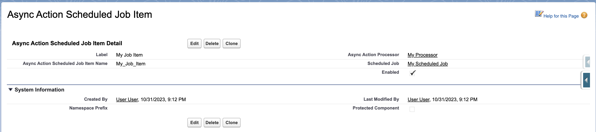

The `AsyncActionScheduledJobItem__mdt` custom metadata type links individual processors to scheduled jobs, defining which async action processors should be executed when a scheduled job runs.

## Overview

AsyncActionScheduledJobItem records create the association between scheduled jobs and processors. Each record represents a single processor that will be launched when its parent scheduled job executes.



## Purpose and Usage

Scheduled job items provide:

1. **Processor Association** - Link specific processors to scheduled jobs
2. **Selective Execution** - Enable/disable individual processors within a schedule
3. **Flexible Grouping** - Organize processors into logical scheduling groups
4. **Execution Control** - Fine-tune which processors run when

## Field Reference

| Field API Name            | Label                  | Data Type             | Required | Description                                            |
| ------------------------- | ---------------------- | --------------------- | -------- | ------------------------------------------------------ |
| `DeveloperName`           | API Name               | Text(40)              | Yes      | Unique identifier for the scheduled job item           |
| `MasterLabel`             | Label                  | Text(40)              | Yes      | Human-readable name for the item                       |
| `ScheduledJob__c`         | Scheduled Job          | Metadata Relationship | Yes      | Reference to AsyncActionScheduledJob\_\_mdt            |
| `AsyncActionProcessor__c` | Async Action Processor | Metadata Relationship | Yes      | Reference to AsyncActionProcessor\_\_mdt               |
| `Enabled__c`              | Enabled                | Checkbox              | No       | Controls whether this processor runs with the schedule |

## Field Details

### ScheduledJob\_\_c

-   Metadata relationship to `AsyncActionScheduledJob__mdt`
-   Determines when this processor will be executed
-   Multiple items can reference the same scheduled job
-   Creates a many-to-one relationship (items → scheduled job)

### AsyncActionProcessor\_\_c

-   Metadata relationship to `AsyncActionProcessor__mdt`
-   Specifies which processor implementation to run
-   Each item can only reference one processor
-   The referenced processor must be enabled to execute

### Enabled\_\_c

-   Master switch for this specific processor within the schedule
-   Allows selective execution without modifying the processor configuration
-   **Checked:** Processor will be launched when scheduled job runs
-   **Unchecked:** Processor will be skipped during scheduled execution

## Configuration Patterns

### Daily Processing Schedule

```
ScheduledJob: Daily_Batch_Processing
├── Item: Process_Account_Updates (Enabled: ✓)
├── Item: Process_Lead_Scoring (Enabled: ✓)
└── Item: Process_Opportunity_Alerts (Enabled: ✗)
```

### Frequent Maintenance Schedule

```
ScheduledJob: Hourly_Maintenance
├── Item: Cleanup_Temp_Records (Enabled: ✓)
└── Item: Update_Statistics (Enabled: ✓)
```

### Business Hours Processing

```
ScheduledJob: Business_Hours_Processing
├── Item: Customer_Notifications (Enabled: ✓)
├── Item: Sales_Follow_ups (Enabled: ✓)
└── Item: Support_Escalations (Enabled: ✓)
```

## Execution Flow

When a scheduled job runs:

1. **Query Items** - Framework queries all enabled items for the scheduled job
2. **Filter Processors** - Only includes items where both item and processor are enabled
3. **Launch Jobs** - Sequentially launches AsyncActionJob for each processor
4. **Error Handling** - Individual processor failures don't affect other processors

```apex
// Simplified framework logic
List<AsyncActionScheduledJobItem__mdt> items = [
    SELECT AsyncActionProcessor__c
    FROM AsyncActionScheduledJobItem__mdt
    WHERE ScheduledJob__c = :scheduledJobName
      AND Enabled__c = true
];

for (AsyncActionScheduledJobItem__mdt item : items) {
    AsyncActionProcessor__mdt processor = /* get processor details */;
    if (processor?.Enabled__c == true) {
        new AsyncActionLauncher().launch(processor);
    }
}
```

## Best Practices

### Organization Strategies

1. **Logical Grouping** - Group related processors in the same schedule
2. **Business Alignment** - Align schedules with business processes
3. **Performance Grouping** - Group similar performance characteristics together
4. **Dependency Management** - Consider processor dependencies when scheduling

### Naming Conventions

```
DeveloperName: {Schedule}_{Processor}_{Purpose}
Examples:
- Daily_Account_Follow_up
- Hourly_Lead_Scoring
- Weekly_Data_Cleanup
```

### Operational Management

1. **Gradual Rollout** - Enable processors incrementally in production
2. **Performance Monitoring** - Watch execution times when adding processors
3. **Error Isolation** - One failed processor shouldn't affect others
4. **Maintenance Windows** - Use separate schedules for maintenance tasks

## Configuration Scenarios

### Load Testing New Processor

```
1. Create disabled item for new processor
2. Test processor independently via AsyncActionLauncher
3. Enable item during low-usage period
4. Monitor performance and adjust if needed
```

### Temporary Processor Disable

```
1. Uncheck Enabled__c on the item
2. Processor stops running with schedule
3. Manual processing still possible via launcher
4. Re-enable when issue is resolved
```

### Seasonal Processing Adjustments

```
1. Create separate schedules for different seasons
2. Enable/disable entire item groups as needed
3. Maintain consistent processor configurations
4. Document seasonal patterns for next year
```

## Monitoring and Troubleshooting

### Query Active Items

```sql
SELECT
    DeveloperName,
    ScheduledJob__c,
    AsyncActionProcessor__c,
    Enabled__c
FROM AsyncActionScheduledJobItem__mdt
WHERE Enabled__c = true
ORDER BY ScheduledJob__c, DeveloperName
```

### Common Issues

**Processor Not Running in Schedule:**

-   Verify item `Enabled__c` is checked
-   Confirm processor `Enabled__c` is checked
-   Check scheduled job is active
-   Review AsyncActionLauncher debug logs

**Performance Degradation:**

-   Monitor cumulative execution time of all items
-   Check for processor overlap/conflicts
-   Consider splitting high-volume processors
-   Review individual processor batch sizes

**Inconsistent Execution:**

-   Verify all related metadata records exist
-   Check for metadata deployment issues
-   Review scheduled job execution history
-   Confirm processor implementations are stable

### Debug Techniques

**Test Item Configuration:**

```apex
// Query items for a specific schedule
List<AsyncActionScheduledJobItem__mdt> items = [
    SELECT DeveloperName, AsyncActionProcessor__c, Enabled__c
    FROM AsyncActionScheduledJobItem__mdt
    WHERE ScheduledJob__c = 'Daily_Processing'
];

for (AsyncActionScheduledJobItem__mdt item : items) {
    System.debug('Item: ' + item.DeveloperName +
                ', Processor: ' + item.AsyncActionProcessor__c +
                ', Enabled: ' + item.Enabled__c);
}
```

**Simulate Scheduled Execution:**

```apex
// Test what would run for a schedule
String scheduleName = 'Daily_Processing';
List<AsyncActionScheduledJobItem__mdt> items = [
    SELECT AsyncActionProcessor__r.DeveloperName
    FROM AsyncActionScheduledJobItem__mdt
    WHERE ScheduledJob__c = :scheduleName
      AND Enabled__c = true
      AND AsyncActionProcessor__r.Enabled__c = true
];

System.debug('Would execute ' + items.size() + ' processors');
for (AsyncActionScheduledJobItem__mdt item : items) {
    System.debug('- ' + item.AsyncActionProcessor__r.DeveloperName);
}
```

## Deployment Considerations

### Source Control

Include both scheduled job and item metadata in deployments:

```xml
<!-- AsyncActionScheduledJobItem metadata -->
<CustomMetadata xmlns="http://soap.sforce.com/2006/04/metadata">
    <label>Daily Account Processing</label>
    <protected>false</protected>
    <values>
        <field>AsyncActionProcessor__c</field>
        <value>Account_Followup_Processor</value>
    </values>
    <values>
        <field>Enabled__c</field>
        <value>true</value>
    </values>
    <values>
        <field>ScheduledJob__c</field>
        <value>Daily_Batch_Processing</value>
    </values>
</CustomMetadata>
```

### Environment Management

-   **Sandbox:** Use smaller schedules for testing
-   **Production:** Full schedules with appropriate monitoring
-   **Development:** Individual processors for unit testing

## Related Objects

-   [AsyncActionScheduledJob\_\_mdt](AsyncActionScheduledJob Custom Metadata Type) - Parent scheduled job configuration
-   [AsyncActionProcessor\_\_mdt](AsyncActionProcessor Custom Metadata Type) - Referenced processor configuration
